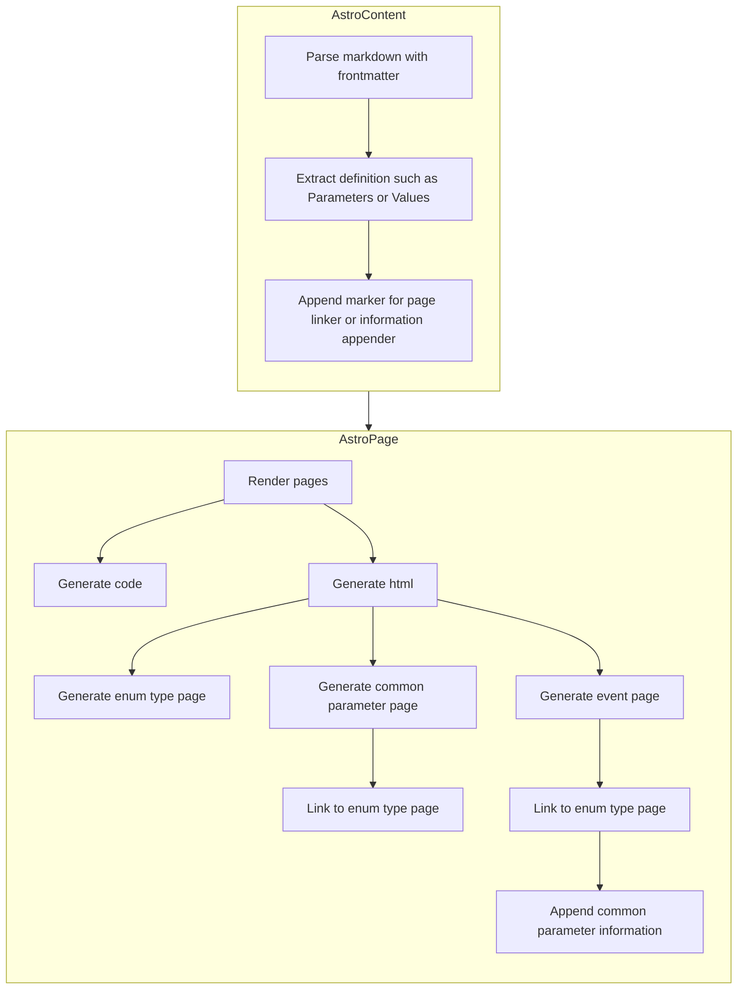

# documented-track-event
This is experimental implementation of log tracker template.

Focuses:
- Document based tracking event
- Generate platform code from document
- User can define common parameter for tracking event
- User can define enum for tracking event

## Examples
Write markdowns:
- [type/user-type.mdx](https://github.com/MeilCliPages/documented-track-event/blob/master/src/content/type/user-type.mdx)
- [common/common-parameter.mdx](https://github.com/MeilCliPages/documented-track-event/blob/master/src/content/common/common-parameter.mdx)
- [event/impression-view.mdx](https://github.com/MeilCliPages/documented-track-event/blob/master/src/content/event/impression-view.mdx)

You can look documents:
- [type/user-type](https://documented-track-event.pages.dev/type/user-type/)
- [common/common-parameter](https://documented-track-event.pages.dev/common/common-parameter/)
- [event/impression-view](https://documented-track-event.pages.dev/event/impression-view/)

## Generating flow

## License
MIT License.